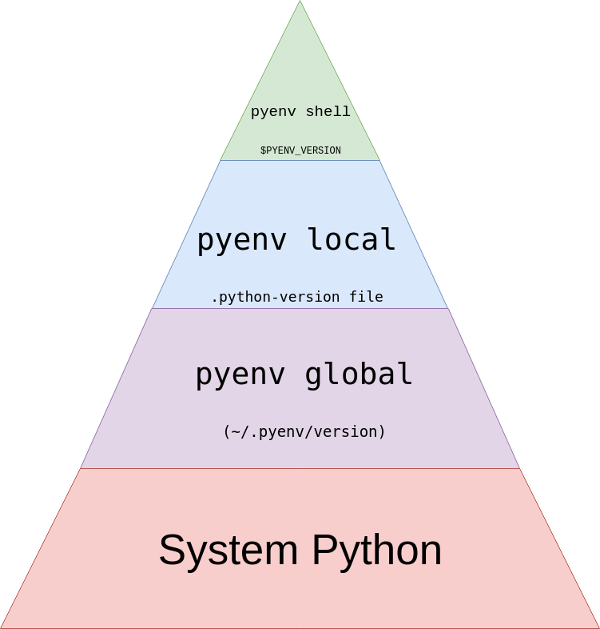

# Pyenv: Gestión de Versiones

## Introducción

El entorno de desarrollo en Python es diverso y versátil, pero también presenta desafíos, especialmente cuando se trata de la gestión de las versiones de Python y las dependencias. Al instalar un sistema operativo, es común encontrarse con una versión de Python preexistente, a menudo denominada "System Python", que es fundamental para el funcionamiento del sistema operativo. Modificar esta instalación puede ser riesgoso y desaconsejable, ya que podría afectar el funcionamiento del sistema en su conjunto.

Además, en el desarrollo de software en Python, es probable que necesitemos trabajar con versiones específicas de Python que no coincidan con la preinstalada en el sistema operativo. Esto es esencial cuando se desarrollan proyectos que deben ser compatibles con múltiples versiones de Python.

Es aquí donde entra en juego [Pyenv](https://github.com/pyenv/pyenv), una herramienta esencial para cualquier desarrollador de Python.

## ¿Qué es Pyenv y por qué es importante?

**Pyenv** es una poderosa herramienta que resuelve ambos problemas mencionados. Permite instalar y gestionar múltiples versiones de Python de forma segura y aislada en su propio entorno. Esto significa que puedes utilizar la versión específica de Python que necesitas para cada proyecto sin preocuparte por afectar el "System Python". Pyenv también es útil para probar tu código en diferentes versiones de Python de manera simultánea.

## Instalación

La instalación de Pyenv es sencilla y altamente recomendada para cualquier desarrollador de Python. Para usuarios de Linux y Mac, se proporciona una [guía detallada](https://github.com/pyenv/pyenv/wiki/Common-build-problems#prerequisites) que te ayudará a configurar los pre-requisitos necesarios antes de usar [pyenv-installer](https://github.com/pyenv/pyenv-installer) para instalar Pyenv en tu sistema.

## Uso

Una vez que tienes Pyenv instalado, puedes aprovechar sus funcionalidades de la siguiente manera:

- **Instalación de Versiones de Python**: Utiliza el comando `pyenv install <VERSION>` para instalar la versión específica de Python que necesitas para tu proyecto.

- **Exploración de Versiones Disponibles**: Puedes ver la lista de versiones de Python disponibles para instalación utilizando `pyenv install -l`. La variedad es amplia, desde Miniconda y Anaconda hasta Cython, Pypy y Jython.

## Recomendaciones

- Configura Pyenv como tu versión de Python por defecto ejecutando `pyenv global <VERSION>`. Esto asegurará que siempre utilices la versión deseada, a menos que especifiques lo contrario.

- Para la gestión de entornos virtuales, considera herramientas como Poetry o Pipenv, que funcionan de manera excelente junto a Pyenv.

En resumen, Pyenv es una herramienta imprescindible para cualquier desarrollador de Python que desee mantener su entorno de desarrollo limpio y seguro, gestionar múltiples versiones de Python de manera efectiva y asegurarse de que sus proyectos funcionen de manera consistente en diferentes entornos. Simplifica tu experiencia de desarrollo con Pyenv y desbloquea todo el potencial de Python en tu trayectoria como desarrollador.